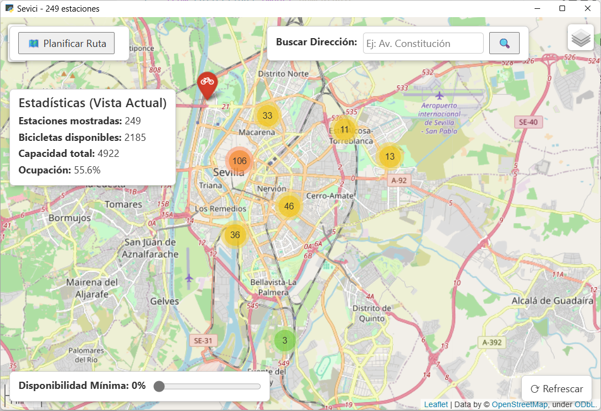

# 🚲 Proyecto de Laboratorio: Estaciones de Alquiler de Bicicletas (Sevici)
## Fundamentos de Programación 1. Grado en Ingeniería Informática – Inteligencia Artificial (Universidad de Sevilla)

Un equipo de desarrollo ha implementado un prototipo de aplicación para usuarios de la red de alquiler de bicicletas de Sevilla (Sevici). Ya tienen una primera versión de la interfaz, pero necesitan de tus conocimientos sobre **tratamientos secuenciales** para que la aplicación sea funcional.



La aplicación realiza consultas a través de la API de la empresa que gestiona el servicio para obtener en tiempo real el estado de las distintas estaciones de alquiler de la red.

---

## Preparación del entorno

👉 Para configurar Git y clonar el repositorio del laboratorio, consulta **[instrucciones_git.md](https://github.com/FP1-25-26/FP1-LAB01-Calculadora-de-viajes-espaciales/blob/main/instrucciones_git.md)**.  

👉 Para poder ejecutar la aplicación gráfica, necesitas instalar estas dependencias (ejecuta el comando desde el terminal):

```
pip install pywebview folium requests
```

---

## ⏱ Duración estimada

2 horas

---

## ✅ ¿Qué se practica?

- Tipos de datos no escalares: `tuple`, `namedtuple` y `list`
- Tratamientos secuenciales

---

## 📁 Archivos del proyecto

Dispones de estos archivos en `src`:

| Archivo                  | Qué hace                                                                  |
|--------------------------|---------------------------------------------------------------------------|
| `sevici_gui.py`      | Interfaz de usuario |
| `sevici_utiles.py`   | Funciones a implementar por el estudiante
| `sevici_utiles_test.py` | Pruebas de las funciones del módulo `sevici_utiles.py`|

---

Las estaciones se representarán mediante la siguiente `namedtuple`:

```python
EstacionSevici = namedtuple("EstacionSevici", 
    "nombre, direccion, latitud, longitud, capacidad, puestos_libres, bicicletas_disponibles")
```

Los campos representan la siguiente información de cada estación:
- nombre: el nombre de la estación, de tipo `str`.
- direccion: la dirección de la estación, de tipo `str`.
- latitud: la latitud de la ubicación de la estación, en grados, de tipo `float`.
- longitud: la longitud de la ubicación de la estación, en grados, de tipo `float`.
- capacidad: el número total de bicicletas que la estación puede albergar, de tipo `int`.
- puestos_libres: el número de puestos disponibles para soltar una bicicleta, de tipo `int`.
- bicicletas_disponibles: el número de bicicletas disponibles, de tipo `int`.

## 📌 Ejercicio 1: Función `selecciona_color`
Implementa la función `selecciona_color` que recibe una estación y devuelve una cadena de texto indicando el color en el que debe pintarse esa estación en la interfaz, en función de la disponibilidad de la misma:
- La disponibilidad se calcula como el número de bicicletas entre la capacidad de la estación. **¡Cuidado!** La capacidad podría ser cero si la estación no está en funcionamiento.
- Si la disponibilidad es mayor o igual a `2/3`, el color a devolver es `"green"`.
- Si la disponibilidad es mayor o igual a `1/3`, el color a devolver es `"orange"`.
- Si la disponibilidad es menor a `1/3` pero mayor a 0, el color a devolver es `"red"`.
- Si la disponibilidad es cero , o si la capacidad es cero (estación fuera de servicio), el color a devolver es `"gray"`.

Prueba la función ejecutando las pruebas del módulo `sevici_utiles_test.py`. 

## 📌 Ejercicio 2: Función `calcula_estadisticas`

Implementa la función `calcula_estadisticas` que recibe una lista de estaciones y devuelve una tupla con las siguientes estadísticas:
- total de bicicletas libres
- total de capacidad
- porcentaje de ocupación, correspondiento un 0% a que todas las bicicletas están aparcadas en las estaciones (el número total de bibicletas coincide con la capacidad total), y un 100% a que no hay ninguna bicicleta disponible. 
- total de estaciones

Prueba la función ejecutando las pruebas del módulo `sevici_utiles_test.py`. 


## 📌 Ejercicio 3: Función `busca_estaciones_direccion`

Implementa la función `busca_estaciones_direccion` que recibe una lista de estaciones y una cadena de texto, y devuelve una lista con aquellas estaciones en cuya dirección aparezca la cadena recibida. La función no debe ser sensible a mayúsculas o minúsculas; por ejemplo, si se busca la dirección "reina mercedes" debe devolver las estaciones en cuya dirección aparezca el texto "Reina Mercedes".

Prueba la función ejecutando las pruebas del módulo `sevici_utiles_test.py`. 

## 📌 Ejercicio 4: Función `busca_estaciones_con_disponibilidad`

Implementa la función `estaciones_con_disponibilidad` que recibe una lista de estaciones y un número real entre 0 y 1, y devuelve una lista con aquellas estaciones que tengan una disponibilidad mayor o igual al valor recibido. 

Prueba la función ejecutando las pruebas del módulo `sevici_utiles_test.py`. 

## 📌 Ejercicio 5: Función `calcula_ruta`

Implementa la función `calcula_ruta`, que recibe una lista de estaciones, y las coordenadas (latitud, longitud) de dos puntos (origen y destino), y devuelve una tupla con las estaciones más cercanas al origen y al destino.

**Antes de implementar esta función**, implementa estas otras dos:

- Función `calcula_distancia`: recibe dos `tuple[float, float]` que representan coordenadas geográficas, y devuelve la distancia entre ambas. Utilice la fórmula de la distancia euclidea.
- Función `busca_estacion_mas_cercana`: recibe una lista de estaciones y una tupla que indica unas coordenadas geográficas, y devuelve la estación más cercana a dicha ubicación.

Una vez implementada `calcula_ruta`, pruébala ejecutando las pruebas del módulo `sevici_utiles_test.py`.

---

Ahora puedes ejecutar el módulo `sevici_gui.py` y probar que todo va bien en la aplicación gráfica.
